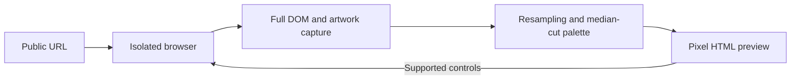

<p align="center"></p>

<p align="center">
  <a href="https://github.com/kenny2077/Pixel-Web/actions/workflows/ci.yml"></a>
  <a href="LICENSE"></a>
  <a href="https://kenny2077.github.io/Pixel-Web/">View demo</a> · <a href="#quick-start">Quick start</a> · <a href="README.zh-CN.md">中文</a>
</p>

Turn a public website into a full-page, clickable pixel-style preview. Keep its layout, recognizable images and working controls. Conversion uses image algorithms and pixel fonts, with no AI calls.

**[Explore the recorded comparison](https://kenny2077.github.io/Pixel-Web/)** or run the converter locally. The demo shows captured results; it does not accept new URLs. Pixel Web is an early release, with a tested core and documented compatibility limits.

## What it does

| | |
| --- | --- |
| **Full pages** | Preserve rendered text, layout, columns, backgrounds and below-fold content. |
| **Source interaction** | Forward supported menus, buttons, inputs and forms to an isolated source browser. Links continue in pixel mode. |
| **Readable artwork** | Give images and small icons finer pixels and a larger palette than background artwork. Preserve avatar shapes. |
| **English and Chinese** | Use self-hosted Pixelify Sans and Fusion Pixel CJK. Protect icon-font glyphs. |
| **Style control** | Choose pixel headings, all pixel text or original fonts; adjust background pixel size, palette and dithering. |
| **Static media and PDFs** | Capture supported dynamic media as stills. Render PDF pages with clickable annotations. |

## Quick start

Requires **Node.js 22+**, **Python 3.10+**, and a browser. macOS uses installed Google Chrome; Linux uses Playwright Chromium.

```bash
git clone https://github.com/kenny2077/Pixel-Web.git
cd Pixel-Web
npm ci
python3 -m venv .venv
source .venv/bin/activate
pip install -r requirements-pdf.txt

# Linux: also install the browser and its system dependencies
npx playwright install --with-deps chromium

npm start
```

Open **http://127.0.0.1:4173**, paste a public URL, and select **Convert**. All pixel text is the default. Use **Style** to adjust the result or compare original fonts and artwork. Windows setup has not been verified.

## How it works



Source JavaScript stays in the source browser. The displayed document executes only Pixel Web's interaction bridge. It keeps selectable text and semantic controls, rather than turning the entire page into one screenshot.

The image pipeline uses Lanczos resampling, weighted median-cut quantization and integer pixel replication. English and Chinese text use pixel fonts. Converted artwork has a bounded content cache; unchanged bottom-scroll checks keep the current preview.

## Performance and hosting

Conversion time depends on the source website, browser startup, page length and artwork. A repeated-image fixture improved from 1,650ms to 79ms after deduplication; this is **not** a whole-page speed guarantee. [Measurement method and trade-offs](docs/performance.md).

| Platform | Role |
| --- | --- |
| **GitHub Actions** | Install from the lockfile and run automated tests. Not an interactive conversion server. |
| **GitHub Pages** | Serve the lightweight recorded comparison and setup guide. No browser backend. |
| **Local Node server** | Run the full converter and retained source sessions. |
| **Cloudflare Container** | Experimental deployment configuration in `cloudflare/`. Requires Workers Paid. Not deployed or performance-validated. |

Cloudflare may improve capacity or network proximity, but it does not remove source-page waits. Compare cold startup and warm requests before claiming a speed improvement. [Hosting notes](docs/hosting.md).

## Compatibility and limits

- One conversion or action runs at a time. Up to three source sessions are retained, each for ten minutes. A restart ends sessions.
- Initial source contexts have a 55-second deadline; interaction refreshes have a 50-second deadline. Readiness waits are bounded, so exceptionally late content can still be missed.
- Infinite feeds cannot have a finite whole-page result. The converter traverses the page within a bounded preparation window.
- Cross-origin iframe apps, WebSockets, uploads, downloads and device permissions are not fully proxied. CAPTCHA restrictions are not bypassed. Account and payment workflows are not verified.
- Still media is a visual fallback, not a guarantee that every video player or canvas application remains functional.
- Private destinations are blocked, but DNS is not pinned. Keep the server local or access-controlled; this is not a hardened public proxy. Read [SECURITY.md](SECURITY.md).

## Development

```bash
pip install -r requirements-dev.txt
npm test                 # Serial algorithm, browser, layout, PDF and API tests
npm run check:repo       # Documentation links and portable dependency metadata
npm run verify           # Live website smoke checks; start the server first
```

Live checks save results to ignored `artifacts/`. Automated CI uses synthetic fixtures so upstream site changes do not break every pull request. [Contributing](CONTRIBUTING.md) explains the workflow and Conventional Commits.

## License and credits

Code is [MIT licensed](LICENSE). Bundled fonts retain their own licenses; see [third-party notices](THIRD_PARTY_NOTICES.md). Captured websites retain their original ownership and terms.

Visual inspiration: [Sprite Fusion Destroy](https://destroy.spritefusion.com/). Repository presentation was studied from [Hermes Agent](https://github.com/NousResearch/hermes-agent); Pixel Web uses its own branding and screenshots.
