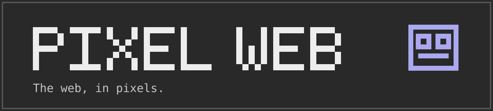
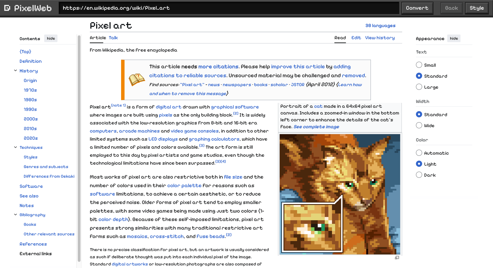
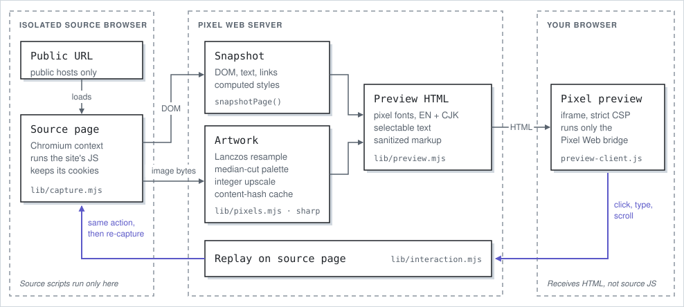

# Pixel Web



把公开网站转换为完整、可点击的 pixel-style preview。保留原有 layout、清晰图片和受支持的 controls。转换使用 image algorithms 和 pixel fonts，不调用 AI。

[打开交互 demo](https://kenny2077.github.io/Pixel-Web/) · [English README](README.md) · [贡献指南](CONTRIBUTING.md)

Demo 使用 Render Free，默认打开 Wikipedia Pixel art，也接受公开 URL。休眠后 cold start 可能需要约一分钟，复杂页面可能超出免费实例内存。本项目为早期版本，不保证每个网站都能完整交互。

<a href="https://pixel-web-a3t7.onrender.com/"></a>

<p align="center"><sub>Pixel Web 转换后的 Wikipedia <i>Pixel art</i> 条目。保留 layout、links 和可选择文字；图片以较少颜色重新渲染。</sub></p>

## 本地运行

需要 Node.js 22+、Python 3.10+ 和浏览器。macOS 使用已安装的 Google Chrome；Linux 使用 Playwright Chromium。Windows 尚未验证。

```bash
git clone https://github.com/kenny2077/Pixel-Web.git
cd Pixel-Web
npm ci
python3 -m venv .venv
source .venv/bin/activate
pip install -r requirements-pdf.txt
# Linux 还需要执行：
npx playwright install --with-deps chromium
npm start
```

打开 http://127.0.0.1:4173，粘贴公开 URL，点击 Convert。默认使用 All pixel text。在 Style 中可以更换文字、pixel size、palette 和 dithering。

也可以使用 Docker，无需单独安装 Node、Python 和浏览器：

```bash
docker build -t pixel-web .
docker run --rm -p 127.0.0.1:4173:4173 pixel-web
```

## 工作原理

<picture>
  <source media="(prefers-color-scheme: dark)" srcset="docs/assets/architecture-dark.svg">
  
</picture>

源网页的脚本不会在你的浏览器中运行。图片经过 Lanczos resampling、weighted median-cut 量化和整数像素放大；preview 是带 pixel fonts 的普通 HTML，文字保持可选择。

## 功能

- 保留整页 DOM、双栏、footer 和下半页内容。
- 把受支持的按钮、菜单、输入和表单操作传回隔离的 source browser。
- 图片与小 icons 使用更细的像素和更多颜色，头像保留原始形状。
- 支持英文和中文 pixel fonts；保留 icon fonts。
- 复杂媒体可显示 static frame；PDF 保留可点击 annotations。
- 重用相同图片的转换结果。页底没有新增内容时，不重建预览。

## 测试与部署

```bash
pip install -r requirements-dev.txt
npm test
npm run check:repo
# 启动本地服务后：
npm run verify
```

GitHub Actions 用于测试。GitHub Pages 跳转到 Render 交互服务。Cloudflare Container 配置已准备，但尚未部署或验证速度；需要 Workers Paid plan。首次加载仍受原网站网络影响，没有固定的速度保证。

当前一次只执行一个转换或操作。本地默认保留三个 source sessions，每个十分钟。免费公开服务保留一个页面，五分钟后过期；其他访客转换新页面也会替换它。WebSockets、复杂 iframe、上传下载和账号支付流程尚未完整支持。完整限制见 [English README](README.md#compatibility-and-limits) 和 [SECURITY.md](SECURITY.md)。

代码使用 [MIT license](LICENSE)。字体与录制网站保留各自许可。见 [第三方说明](THIRD_PARTY_NOTICES.md)。
